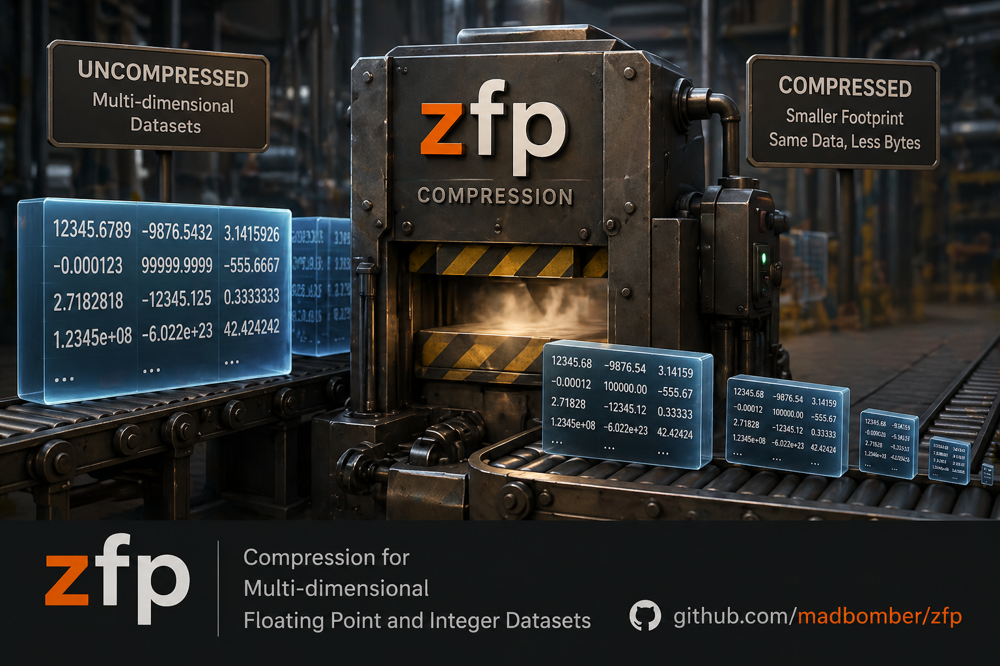

<script>
document.addEventListener("DOMContentLoaded", function () {
  var h1 = document.querySelector(".md-content__inner > h1");
  if (h1) h1.style.display = "none";
});
</script>

<div class="zfp-hero">
  
</div>

> _Because your floats deserve better than Base64._

[](https://rubygems.org/gems/zfp)
[](https://github.com/madbomber/zfp/blob/main/LICENSE)

**`zfp`** brings [LLNL's battle-hardened ZFP compression library](https://computing.llnl.gov/projects/zfp) to Ruby. ZFP was built by national-lab scientists to compress petabytes of floating-point simulation data without losing the ability to do science on it. Now it's in a Ruby gem.

Whether you're cramming ten years of OHLCV market data into Redis, shipping a million embedding vectors over the wire, or just deeply offended by how wasteful `Array#pack("E*")` is — this gem is for you.

---

## What ZFP Actually Does

ZFP compresses *n*-dimensional arrays of floats, doubles, int32s, and int64s — up to 4 dimensions — using a floating-point-aware transform that exploits spatial correlation across array elements. Unlike general-purpose compressors, it understands the structure of numeric data.

## Compression Modes at a Glance

| Mode | What it does | Good for |
|---|---|---|
| `:reversible` | Bit-exact lossless | Audit trails, exact P&L, anything you'll diff |
| `:fixed_rate` | Guaranteed bits-per-value | Streaming, fixed-size storage slots |
| `:fixed_precision` | Guaranteed significant bits | Scientific reproducibility |
| `:fixed_accuracy` | Guaranteed absolute error bound | Financial data, ML embeddings, tolerance-bounded work |

## Five-Second Example

```ruby
require "zfp"

prices = [174.21, 174.85, 173.40, 175.10, 176.33]  # ... 10,000 more

# Self-describing pack — no metadata bookkeeping required
packed   = Zfp.pack(prices, type: :double, shape: [prices.size], mode: :reversible)
restored = Zfp.unpack(packed)

prices == restored  # => true
```

## Where to Go Next

- [**Installation**](installation.md) — install `libzfp` and add the gem
- [**Quick Start**](quickstart.md) — compress and decompress in five minutes
- [**Compression Modes**](compression-modes.md) — choose the right mode for your data
- [**Multi-Dimensional Arrays**](multi-dimensional.md) — 1-D through 4-D
- [**Numo::NArray**](numo-narray.md) — auto-detection and round-trip support
- [**API Reference**](api/index.md) — complete method documentation
- [**Examples**](examples/index.md) — runnable scripts
